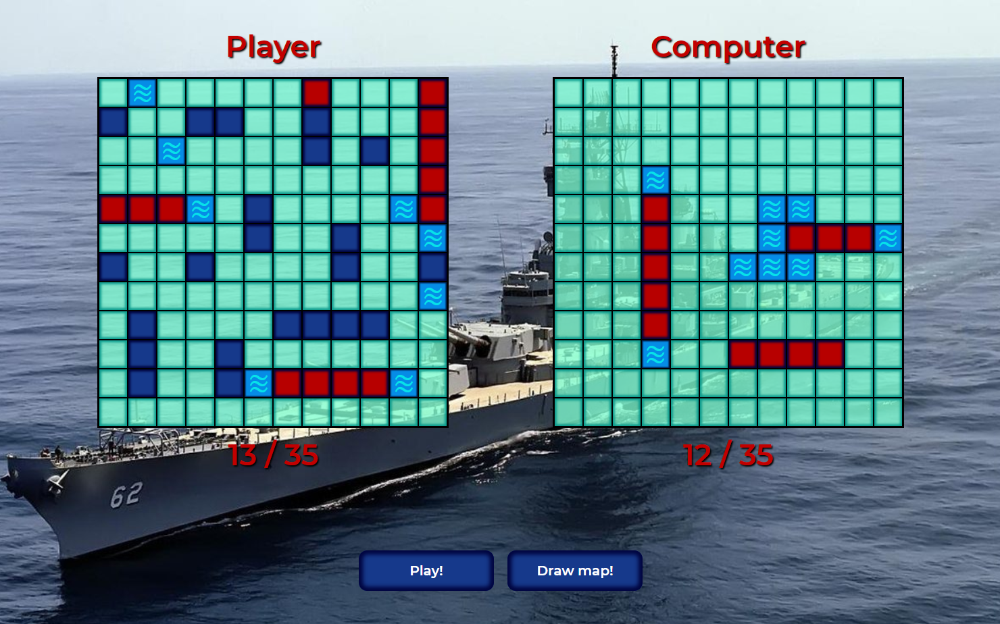

# BattleShip



## Live

<https://maciejspalek.github.io/BattleShip/>

 ## Description
The BattleShip is a classical game from childhood.
Firstly draw the map, click play button and try to beat computer, but it's not so easy, as it might seems. The application has two main algorithms: the first one is for setting ship's position and the second one is for computer’s move as an opponent.


 ## Tech/framework used
 * HTML
 * BEM
 * CSS + SASS
 * JS + jQuery
 * Responsive Web Design


## Installation

```
git clone https://github.com/MaciejSpalek/BattleShip.git

npm install

npm start
```

